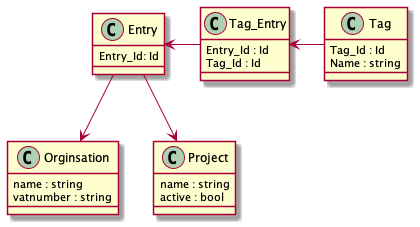
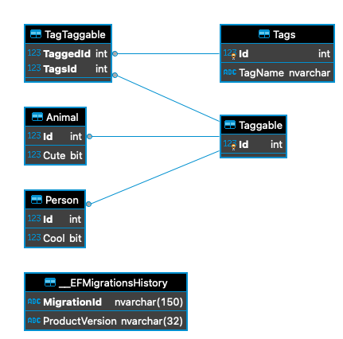
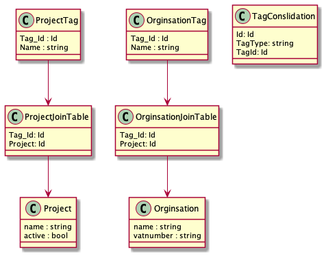

# Throw Away Tag Test

Explore the idea of having a TPT(Table Per Type) model and applying tags via a many to many association within EF Core 5.0.

## Plan

Produce the following design in EF.

## Result

The approach works, but could be restricting due to all entities requiring tagging having to inherit from `Taggable`.

## Alternative

Could be an option to just create tag tables for each object you wish to tag and if the need to search all tags is required have a table which consolidates all those tags in one place.

something to maybe explore in another throwaway project.